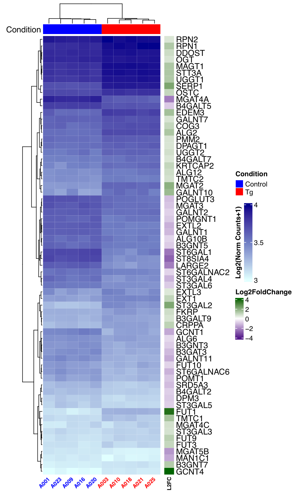
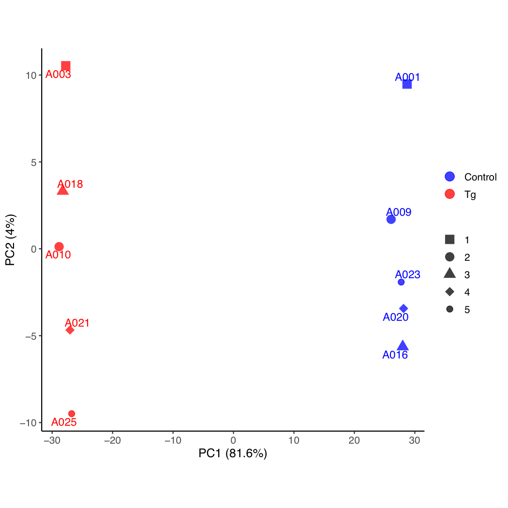
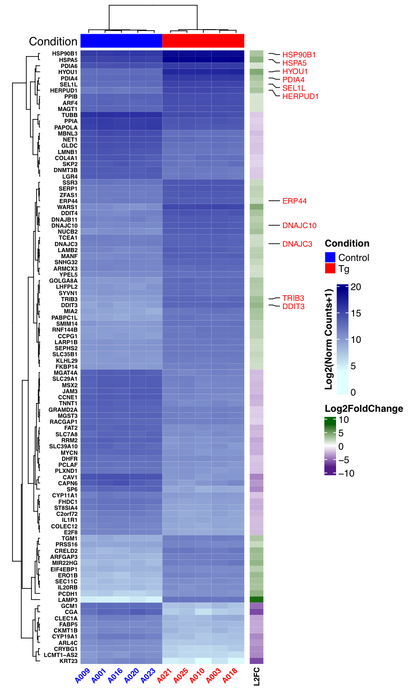
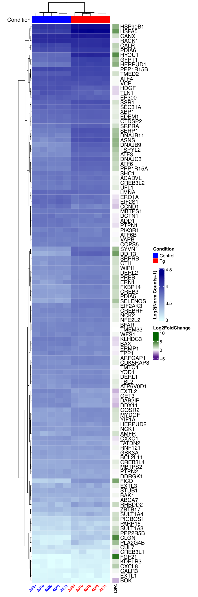
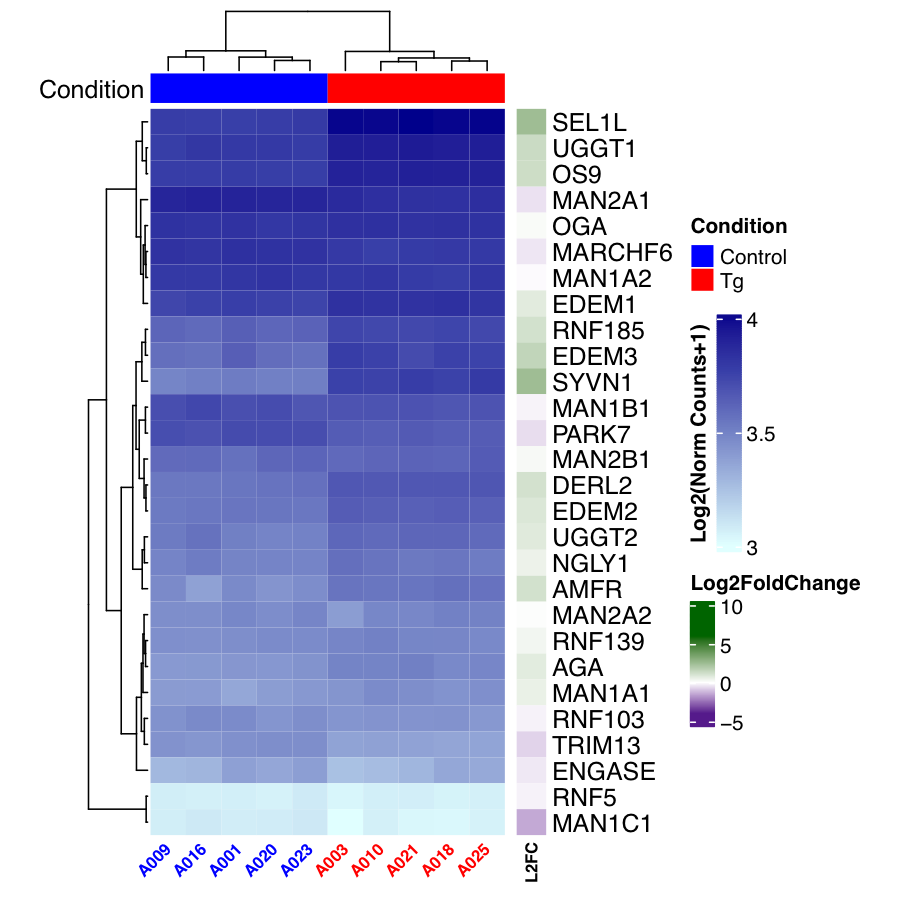
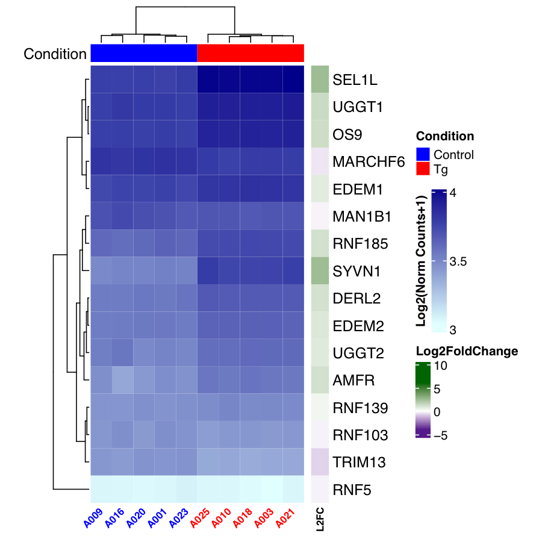

# Perturbation of placental endocrine function by endoplasmic reticulum stress leads to maladaptation of maternal hepatic glucose metabolism

Hong Wa Yung <sup>1\* </sup>, Luke Glover<sup>1</sup>, Xiaohui Zhao<sup>1</sup>, Charlotte Burrin<sup>1</sup>, Khalid Abu-Zeinah<sup>1</sup>, Poh-Choo Pang<sup>2</sup>, Kate Duhig<sup>3</sup>, Matts Olovsson<sup>4</sup>, Carolyn J. P. Jones<sup>5</sup>, Anne Dell<sup>2</sup>, Stuart M. Haslam<sup>2</sup>, Lucy Chappell<sup>3</sup>, Graham J Burton <sup>1\* </sup> and D. Stephen Charnock-Jones<sup>1,6\* </sup> <br>

<sup>1</sup> Centre for Trophoblast Research, University of Cambridge, UK. <br>
<sup>2</sup> Department of Life Sciences, Imperial College London, London, UK.<br>
<sup>3</sup> Department of Women and Children’s Health, School of Life Course Sciences, King’s College London, London UK. <br>
<sup>4</sup> Department of Women’s and Children’s Health, Uppsala University, Sweden<br>
<sup>5</sup> Division of Developmental Biology & Medicine, University of Manchester, Manchester, UK.<br>
<sup>6</sup> Department of Obstetrics and Gynaecology, University of Cambridge, UK.<br>

\* These authors contributed equally to the manuscript <br>
**Corresponding authors:** Prof D. Stephen Charnock-Jones (dscj1@cam.ac.uk) and Dr Hong Wa Yung (hwy20@cam.ac.uk)

## Abstract

Pregnancy imposes considerable physiological stress on the mother as maternal metabolism has to adapt to support the growing fetus. The placenta orchestrates many of these maternal changes through secretion of peptide hormones, many of which are heavily glycosylated. Endoplasmic reticulum (ER) stress alters the glycosylation of both secreted and membrane glycoproteins affecting their activity. ER stress is a prominent feature of the placenta in cases of early onset pre-eclampsia (ePE). Therefore, we hypothesize that placental ER stress may compromise glycosylation of placentally-derived glycoproteins, resulting in maternal physiological maladaptations. Firstly, glycomic analysis revealed ER stress alters N-glycosylation of proteins secreted by BeWo trophoblast cells, with reduced complexity and end-capping sialylation of glycan structures. Glycosylation of human chorionic gonadotropin, placental growth factor and vascular endothelial growth factor (VEGF) was all reduced, and the misglycosylated VEGF lost its bioactivity. RNA-Seq revealed that 93 out the 173 genes annotated with the gene ontology term “protein glycosylation” (GO: 0006486) were changed upon ER stress (Padj <0.05). Using a new ex vivo mouse placental junctional zone explant, we confirmed that ER stress promotes placental secretion of misglycosylated glycoproteins. To investigate this phenomenon in vivo, sera from patients with ePE were subjected to lectin-isolation before proteomic (TMT-LC/MS) analysis. Of seven pregnancy-specific glycoproteins (PSGs) identified, PSG5 and PSG9 showed reduced concentrations, indicating misglycosylation. Using PSG5 as an example, we further demonstrate that the aberrantly glycosylated PSG5 was produced by the ePE placenta. The ePE placentas also displayed reduced expression of several sialyltransferases, key enzymes in sialylation of glycoproteins. To explore potential impact of misglycosylated placentally-derived glycoproteins in maternal adaptations, a new placental junctional zone (Jz)-specific ER stress model (Sp-Perk-/-) was created. As expected, females carrying litters with Sp-Perk-/- placentas showed reduced blood glucose concentrations, anomalous hepatic glucose metabolism and increased embryonic loss. This maladaptation seriously compromised liver energetic status and induced cellular stresses in the maternal liver. Interestingly, there was an increase of DNA methyltransferase 3A (Dnmt3A) expression, suggesting potential epigenetic changes in the stressed hepatic cells. This study provides the first potential mechanistic linkage between early-onset preeclampsia and subsequent poor maternal health.

## SampleTable
SampleName      |   Condition          |No. replicates|  Paired | Lanes|
--------        |  --------------------|--------------| --------|------|
A001	|Control	|3	|1	|SLX8765,SLX-8768,SLX-9610|
A003	|Tg	|3	|1	|SLX8765,SLX-8768,SLX-9610|
A009	|Control	|3	|2	|SLX8765,SLX-8768,SLX-9612|
A010	|Tg	|4	|2	|SLX8765,SLX-8768,SLX-9612|
A016	|Control	|4	|3	|SLX8765,SLX-8768,SLX-9612,SLX-9615|
A018	|Tg	|3	|3	|SLX8765,SLX-8768,SLX-9610|
A020	|Control	|3	|4	|SLX8765,SLX-8768,SLX-9610|
A021	|Tg	|2	|4	|SLX8765,SLX-8768|
A023	|Control	|3	|5	|SLX8765,SLX-8768,SLX-9612|
A025	|Tg	|3	|5	|SLX8765,SLX-8768,SLX-9610|

## Data Availability (Need to complete the Data submission information)

* RNASeq data: EMBL-EBI ArrayExpress **E-MTAB-10943** (https://www.ebi.ac.uk/arrayexpress/experiments/E-MTAB-10943/)

## Methods:

We generated RNA-Seq datasets from BeWo cells treated with and without Tg (5 independent replicate pairs, single-end 50bp). Raw fastq data are submitted to Array Express with accession number E-MTAB-10943 (https://www.ebi.ac.uk/arrayexpress/experiments/E-MTAB-10943/). The alignment and QC were processed using the nextflow (version 21.05.0.edge; Di Tommaso et al., 2017) pipeline nf-core/rnaseq (version 3.2, https://nf-co.re/rnaseq; Ewels et al., 2020) with the option “--aligner star_salmon” and  Ensembl reference genome and annotation for human GRCh38.104. Supplementary Data 2 shows the number of raw reads, mapped reads and the mapping statistics. All scripts, with details of software versions, a pipeline usage report and expression raw count files are in Supplementary Data xx and freely available from https://github.com/CTR-BFX/Yung_Charnock-Jones_Burton. <br>

There are 60504 genes identified after nextflow pipeline in total with Ensembl Gene ID annotation. First, we filtered the low counts by limiting the total number of normalised reads counts on the estimated size factors to be greater than 10 across each gene. There are 23426 genes as input to perform the differential gene expression analysis using DESeq2 package (version 1.30.1; Love, Huber and Anders, 2014) in R (version 4.0.2; Team, 2020). The design formula for DESeq2 analysis is \~Paired\+Condition. After the DESeq2 analysis, a further 2725 genes are removed because the missing p-adjusted values. The total number of genes for the rest of the analysis is down to 20701. Fully DEGs and significant DEGs lists are in Supplementary xx and available in GitHub https://github.com/CTR-BFX/Yung_Charnock-Jones_Burton. <br>

A principal component analysis (PCA) was performed using the topmost variable 2000 genes with variance stabilising transformed expression for gene counts (Supplementary Fig xx). The gene ontology analysis performed using "goprofiler2" package(version xx) with 1712 up regulated and 1482 down regulated DEGs list, respectively. (Supplementary Data xx) <br>

Further analysis to show the relationship between DEGs and gene ontology interests are presented by Heatmaps, and GeneSet enrichment (GSE) plots. Heatmaps are generated using R package ComplexHeatmap (version 2.6.2; Gu et al., 2016). GSE analysis using ClusterProfiler pacakge (version 4.0.5) *gseGO* function. <br>

**References:**

[1] P. Di Tommaso, et al. Nextflow enables reproducible computational workflows. Nature Biotechnology 35, 316–319 (2017) doi:10.1038/nbt.3820<br>
[2] Ewels, P.A., Peltzer, A., Fillinger, S. et al. The nf-core framework for community-curated bioinformatics pipelines. Nat Biotechnol 38, 276–278 (2020). https://doi.org/10.1038/s41587-020-0439-x<br>
[3] R Core Team (2020). R: A language and environment for statistical computing. R Foundation for Statistical Computing, Vienna, Austria. URL https://www.R-project.org/.<br>
[4] Love MI, Huber W, Anders S (2014). “Moderated estimation of fold change and dispersion for RNA-seq data with DESeq2.” Genome Biology, 15, 550. doi: 10.1186/s13059-014-0550-8. <br>
[5] Zuguang Gu, et al., Complex heatmaps reveal patterns and correlations in multidimensional genomic data, Bioinformatics, 2016<br>
[6] Yu G, Wang L, Han Y, He Q (2012). “clusterProfiler: an R package for comparing biological themes among gene clusters.” OMICS: A Journal of Integrative Biology, 16(5), 284-287. doi: 10.1089/omi.2011.0118. <br>
[7] Wu T, Hu E, Xu S, Chen M, Guo P, Dai Z, Feng T, Zhou L, Tang W, Zhan L, Fu x, Liu S, Bo X, Yu G (2021). “clusterProfiler 4.0: A universal enrichment tool for interpreting omics data.” The Innovation, 2(3), 100141. doi: 10.1016/j.xinn.2021.100141. <br>


## Raw fastqs to count matrix pipeline

nextflow (version 21.05.0.edge) nf-core/rnaseq (version 3.2) "star_salmon" pipeline. <br>
The sampleTable input for nextflow is

SampleTable_summary_NF_reverse.csv [[CSV](SampleTable_summary_NF_reverse.csv)]

```shell
 nextflow run nf-core/rnaseq -bg -profile singularity -r 3.2 --singleEnd \
              --skipBiotypeQC --input SampleTable_summary_NF_reverse.csv \
              --aligner star_salmon \     
              --fasta GRCh38.fa \
              --gtf GRCh38.gtf \
              --gtf_extra_attributes 'gene_id' \
              --outdir   ${Outdir} \
              --multiqc_title CTR_gjb2_0002-NF_reverse_Ensembl_104. \
              --email xz289@cam.ac.uk -with-report ${Outdir}/report.html &> ${Outdir}/nextflow_command.log &  
 ```

Full details for QC, aligner et al, check the multiqc report and corresponding data folder. <br>
[1] Report: CTR_gjb2_0002-NF_reverse_Ensembl._multiqc_report.html <br>
[2] Report Data folder: CTR_gjb2_0002-NF_reverse_Ensembl._multiqc_report_Data <br>

**Software Versions in nextflow (nf-core/rnaseq):** <br>

Software      |  Version         | |  Software | Version|
--------      |  ----------------|---| ----------- |---------------|
bedtools|	2.30.0||bioconductor-summarizedexperiment|1.20.0|
bioconductor-tximeta|	1.8.0||deseq2|	1.28.0|
dupradar|	1.18.0||fastqc|	0.11.9|
nextflow|	21.05.0.edge||nf-core/rnaseq|	3.2|
picard|	2.23.9||preseq|	3.1.1|
qualimap|	2.2.2-dev||rseqc|	3.0.1|
salmon|	1.4.0||samtools|	1.1|
star|	2.6.1d||stringtie|	2.1.4|
subread|	2.0.1||trimgalore|	0.6.6|
ucsc|	377||      | |

## DESeq2 + GeneOntology Analysis Results

### Figures Summary links

DESeq2_GO_GSE_Analysis_Mar_2022.R[[Rscript](DESeq2_GO_GSE_Analysis_Mar_2022.R)]

| Figures       | Downloads            |Image         | Legend (Corresponding Fig)|
--------        |  --------------------|--------------| ------------------------  |
Fig2C-GO0006486_top66_FC1.5_Fig_Heatmap.pdf | [[PDF](Figures_Tables/Fig2C-GO0006486_top66_FC1.5_Fig_Heatmap.pdf)]| | Top 66 significant DEGs relating to pathway G0006486. |
SFig1_PCA.pdf | [[PDF](Figures_Tables/SFig1_PCA.pdf)]| | PCA plot shows top 2000 variable genes clustering of BeWo with/without Thapsigargin treatment for 10 individuals analysed by RNA-Seq. |
SFig2B-AllSample-l2Norm_top100_Fig_Heatmap.pdf | [[PDF](Figures_Tables/SFig2B-AllSample-l2Norm_top100_Fig_Heatmap.pdf)]| | Heatmap plot for the top 100 most variable genes for all samples.|
SFig3-1_GSEA1_Fig_Heatmap.pdf | [[PDF](Figures_Tables/SFig3-1_GSEA1_Fig_Heatmap.pdf)]| | Heatmap plot for Gene set enrichment analsis relating to pathway ER UPR.|
SFig3-2_GSEA2_Fig_Heatmap.pdf | [[PDF](Figures_Tables/SFig3-2_GSEA2_Fig_Heatmap.pdf)]| | Heatmap plot for Gene set enrichment analsis relating to pathway ER Mannose Trimming.|
SFig3-3_GSEA3_Fig_Heatmap.pdf | [[PDF](Figures_Tables/SFig3-3_GSEA3_Fig_Heatmap.pdf)]| | Heatmap plot for Gene set enrichment analsis relating to pathway protein Deglycosylation.|


### All tables have been merged to a xlsx file and method below
| Tables       | Downloads            |
--------       |  --------------------|
Combined_supplementary_tables.xlsx |[[XLSX](Figures_Tables/Combined_supplementary_tables.xlsx)]|


## Software R Versions & Methods

````
R version 4.0.2 (2020-06-22)
Platform: x86_64-pc-linux-gnu (64-bit)
Running under: Ubuntu 16.04.7 LTS

Matrix products: default
BLAS:   /storage/Software/packages/R-4.0.2/lib/libRblas.so
LAPACK: /storage/Software/packages/R-4.0.2/lib/libRlapack.so

locale:
 [1] LC_CTYPE=en_GB.UTF-8       LC_NUMERIC=C              
 [3] LC_TIME=en_GB.UTF-8        LC_COLLATE=en_GB.UTF-8    
 [5] LC_MONETARY=en_GB.UTF-8    LC_MESSAGES=en_GB.UTF-8   
 [7] LC_PAPER=en_GB.UTF-8       LC_NAME=C                 
 [9] LC_ADDRESS=C               LC_TELEPHONE=C            
[11] LC_MEASUREMENT=en_GB.UTF-8 LC_IDENTIFICATION=C       

attached base packages:
 [1] grid      parallel  stats4    stats     graphics  grDevices utils    
 [8] datasets  methods   base     

other attached packages:
 [1] ComplexHeatmap_2.6.2        ggalt_0.4.0                
 [3] BiocParallel_1.24.1         ggbeeswarm_0.6.0           
 [5] scales_1.1.1                RColorBrewer_1.1-2         
 [7] pheatmap_1.0.12             ggforce_0.3.3              
 [9] biomaRt_2.47.9              DESeq2_1.30.1              
[11] SummarizedExperiment_1.20.0 Biobase_2.50.0             
[13] MatrixGenerics_1.2.1        GenomicRanges_1.42.0       
[15] GenomeInfoDb_1.26.7         IRanges_2.24.1             
[17] S4Vectors_0.28.1            BiocGenerics_0.36.1        
[19] reshape2_1.4.4              reshape_0.8.8              
[21] useful_1.2.6                matrixStats_0.58.0         
[23] Matrix_1.3-3                cowplot_1.1.1              
[25] ggrepel_0.9.1               ggplot2_3.3.3              
[27] dplyr_1.0.6                 tidyr_1.1.3                

loaded via a namespace (and not attached):
 [1] bitops_1.0-7           bit64_4.0.5            ash_1.0-15            
 [4] progress_1.2.2         httr_1.4.2             tools_4.0.2           
 [7] utf8_1.2.1             R6_2.5.0               KernSmooth_2.23-20    
[10] vipor_0.4.5            DBI_1.1.1              colorspace_2.0-1        
 .....           
````

## Contact

Contact Xiaohui Zhao (xz289 -at- cam.ac.uk)
